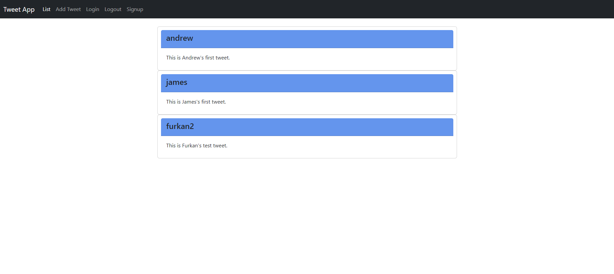
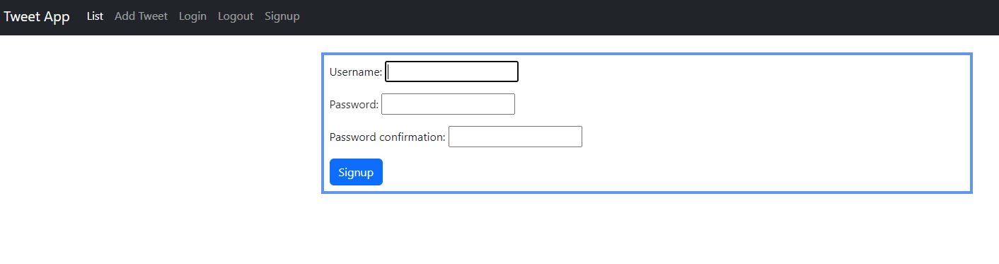
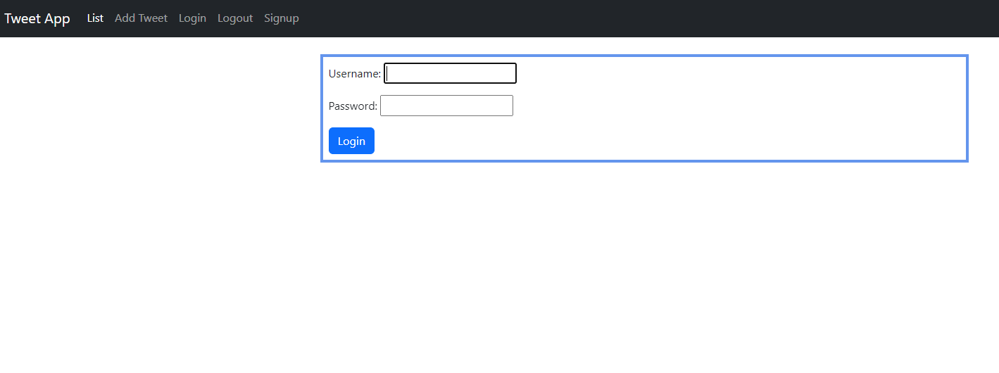
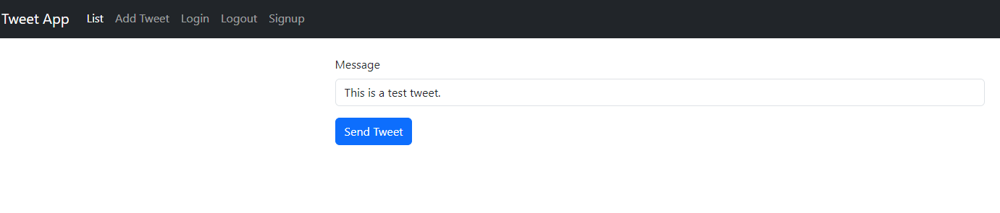
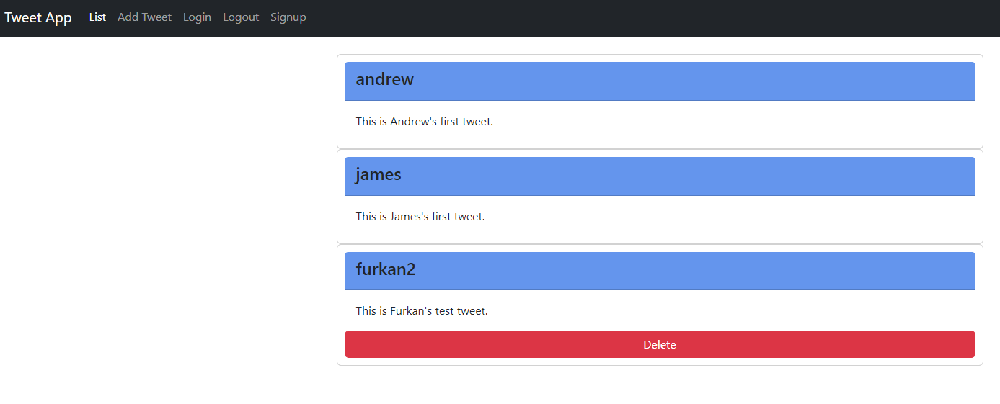

# PP6-DjangoTweet
This is a twitter clone written in django language. With this application, users can log in to post tweets and view others' tweets. Logged-in users can delete their own tweets. However, other users can only read tweets and cannot make any changes. To create a new account, they are directed to the 'Sign Up' tab. After creating a new account, they are redirected to the login screen to log in.

## Tweet App Menu
This is the screen that users will see as soon as they enter the application. Even without logging in, users can read other users' tweets.

## Sign Up
At this initial screen, users who do not have an account can create a new account to start tweeting and gain the ability to post their own tweets. Users without an account can read other users' tweets, but to actively participate and post tweets, they are encouraged to sign up and join the community.

## Login
After creating an account, users are automatically redirected to the login screen. Here, users can enter their username and password to log into the application. Once logged in, they can start posting tweets and engaging with the platform.

## Add Tweet
A logged-in user has the privilege to access the 'Add Tweet' section.

## List
After a user posts a tweet, they are automatically directed to the 'List' section. Here, users can view their own tweets as well as other tweets. However, in this view, users can only delete their own tweets and can only read other tweets without making any modifications.

